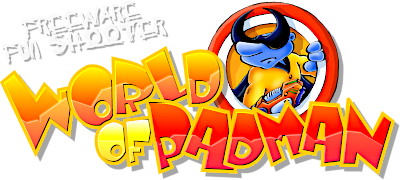

# Padworld Entertainment

Padworld Entertainment is the [team behind "World of Padman" (WoP)](https://worldofpadman.net/about/team/), the standalone game successor of the ["PadMod"](https://worldofpadman.net/download/padmod-q3a/) modification for [Quake 3 Arena](https://en.wikipedia.org/wiki/Quake_III_Arena).

## World of Padman

[World of Padman](https://worldofpadman.net/about/) is a fun freeware shooter with open source code, which you can find in the [`PadWorld-Entertainment` GitHub organization](https://github.com/PadWorld-Entertainment).
